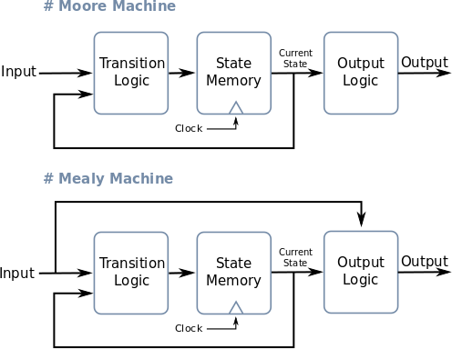
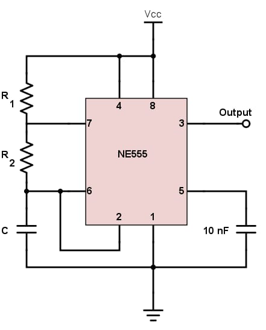
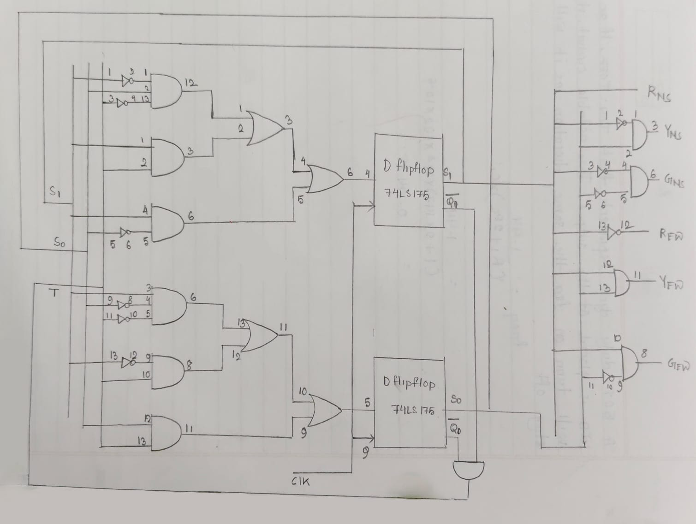
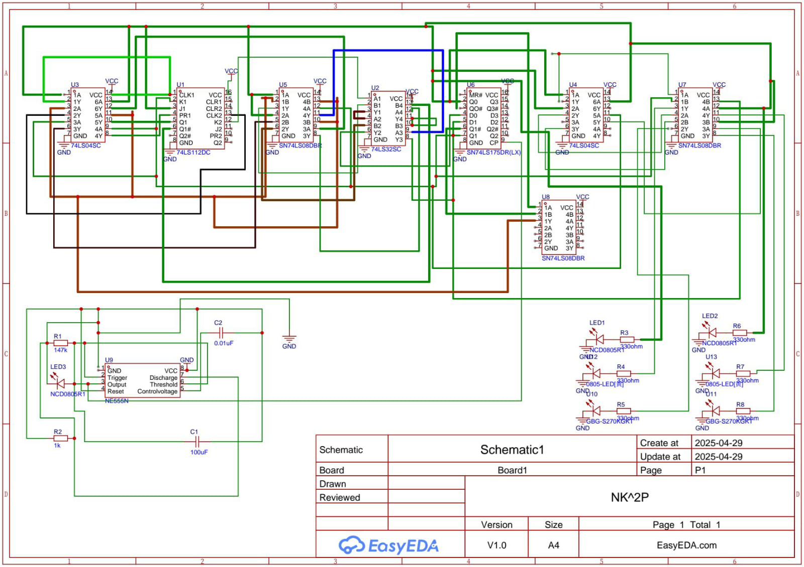
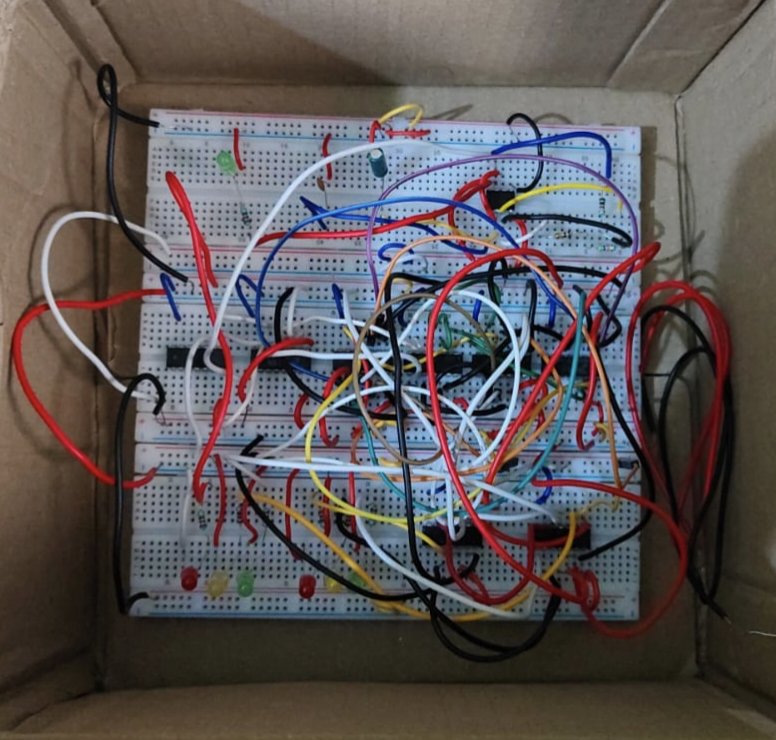
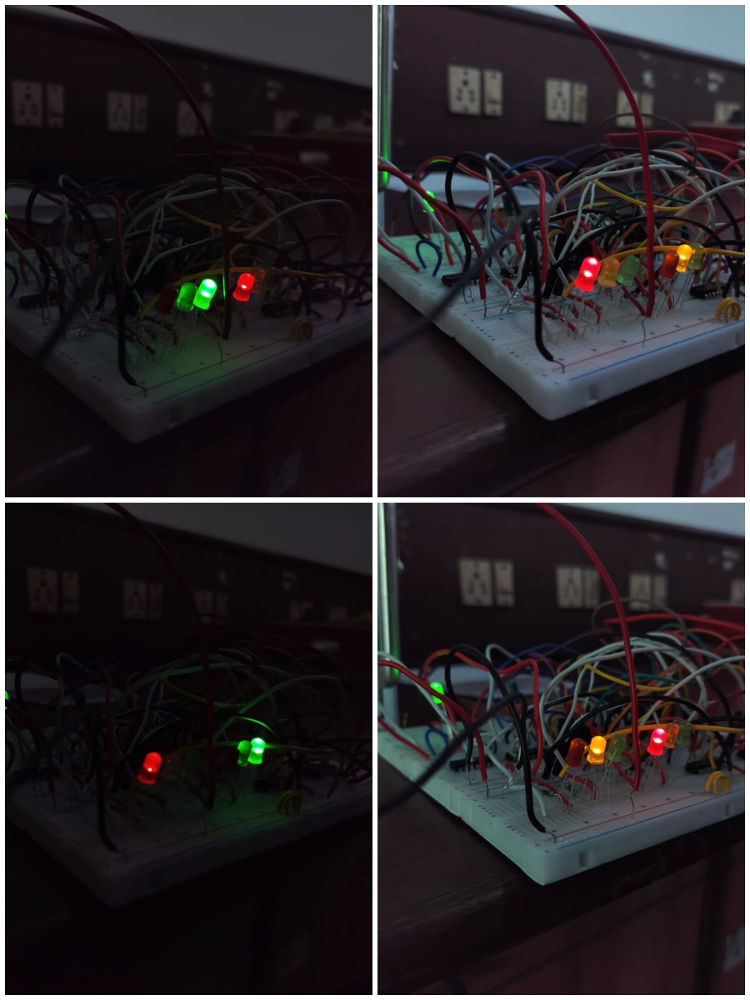

# 🚦 Two-Way Traffic Signal Using FSM and Logic Gates (Built from Scratch)

This project implements a **two-way traffic light system** using a **Finite State Machine (FSM)** built entirely with **logic gates**, **D flip-flops**, and a **555 Timer-based clock circuit**—no microcontroller or software code involved. The circuit models a real-world intersection with alternating green and red signals for two directions (e.g., North-South and East-West).

---

## 📷 Preview

  
   
  <em>Finite State Machine Diagram</em>

---

## 🧠 Project Overview

* 🚦 **FSM-Based Traffic Control**: Manages light transitions between North-South and East-West directions.
* ⏱ **555 Timer Clock**: Generates the timing pulses needed to change states automatically.
* 🔩 **Pure Hardware**: Designed without microcontrollers, using only logic gates and D flip-flops.

---

## 🔧 Hardware Components Used

| Component                | Description                               |
| ------------------------ | ----------------------------------------- |
| **555 Timer IC**         | Generates the clock signal for FSM        |
| **D Flip-Flops**         | Stores current FSM state                  |
| **Logic Gates**          | AND, OR, NOT, for state logic   |
| **LEDs**                 | Represents Red, Yellow, and Green signals |
| **Resistors/Capacitors** | For timing and LED current limiting       |
| **Breadboard / PCB**     | For physical circuit implementation       |

---

## 📄 FSM Design

### 🔁 States:

1. **S0** – North-South Green, East-West Red
2. **S1** – North-South Yellow, East-West Red
3. **S2** – North-South Red, East-West Green
4. **S3** – North-South Red, East-West Yellow

### 🔀 Transitions:

State transitions are driven by the clock pulses from the 555 Timer.

  
   
  <em>State Transition Table (based on current state)</em>

---

## ⏲ Clock Generation Circuit (555 Timer)

  
   
  <em>555 Timer Circuit generating square wave as clock input</em>

* **Mode**: Astable
* **Function**: Outputs periodic clock pulses to advance FSM
* **Adjustable**: Change resistor/capacitor values to modify signal duration

---

## 🔌 Circuit Implementation

  
   
  <em>Full schematic including FSM logic, 555 timer, and LED outputs</em>

> Full circuit files are available in the `/circuit_files/` directory.

---

  
   
  <em>Full schematic including FSM logic, 555 timer, and LED outputs</em>

> Full circuit files are available in the `/circuit_files/` directory.

---

## 🧪 Simulation & Testing

* Built and tested on **breadboard**
* Used **LEDs** to visually verify state transitions
* Optional simulation in tools like **Logisim** for verification

  
   
  <em>Photo: Real-life hardware setup (optional)</em>

  
   
  <em>Photo: Real-life hardware setup (optional)</em>

---

## 📚 Learning Outcomes

* Build a **working FSM** using only gates and flip-flops
* Understand **555 timer** design for generating clock pulses
* Apply **digital logic design principles** to real-world control systems
* Practice **hardware troubleshooting and testing**

---

## 🚀 Possible Extensions

* Add **pedestrian crossing signals**
* Include **manual override** or **vehicle sensors**
* Extend to **4-way intersection FSM**
* Make signal durations **adjustable with potentiometers**

---

## 📜 License

MIT License — open to use, modify, and learn from.

---

Would you like help creating any of the diagrams or circuit drawings (FSM, 555 timer, state table) for your repo? I can generate templates for those.
